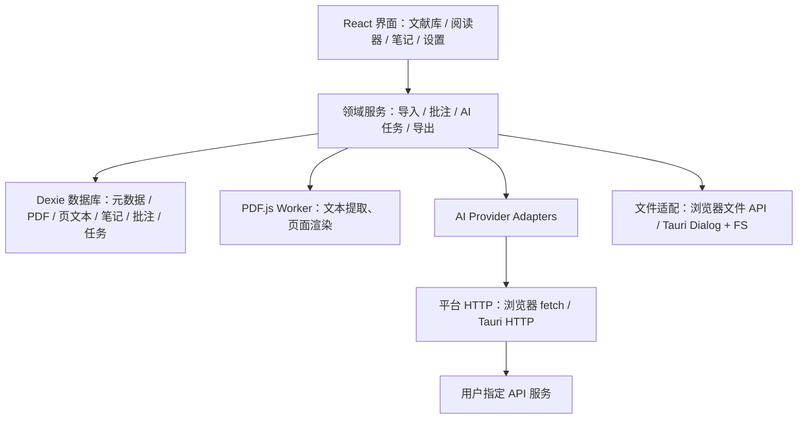

# Paperead 架构与技术决策

## 0.1.5 增量设计

- 数据模型升至 schema 3，新增笔记文件夹、共享图片附件和备份快照表；页面保留识别引擎、置信度与模型来源；论文区分 PDF 和纯引用记录，并标明元数据核验状态。
- Markdown 统一经 remark AST 解析后输出 PDF/Word。PDF 使用 pdfmake、内置 Noto 中文字体及 MathJax SVG；Word 使用结构化表格、图片及 KaTeX MathML 转常见 OMML。Markdown/HTML 导出将本地附件内嵌，批量笔记 ZIP 使用相对图片路径。
- OCR 复用持久任务及全局取消机制：Tesseract.js 7 本地 Worker、离线中英文模型；视觉识别按服务商协议发送页面图。逐页提交结果、正文和图片的单个数据库事务，断点只重试未完成页面，输出仍为连续 Markdown。OCR 与同文献其他任务互斥，既有翻译输入快照不被覆盖。
- 备份格式 4 包含附件校验和、笔记历史及识别任务；兼容 1–3。恢复先完整验证和预览，再创建独立恢复前快照，最后事务合并。快照不进入快照备份，避免递归膨胀；Windows 快照使用 AppLocalData/backups 的临时文件写入和重命名，保留数量按类型隔离。
- Citation.js 处理本地 BibTeX/RIS，浏览器构建替换其 Node 网络传输依赖；元数据联网补全由单独的 Crossref 请求执行，预览和应用均由用户操作触发。
- Android 凭据通过自有 Tauri Kotlin 插件进入 Android Keystore，加密密文独立写入 noBackupFilesDir；此平台尚待原生编译和设备验证。Windows 原系统凭据协议保持兼容。
- 用户已排除 WebDAV，不加入后台同步或服务端。平台构建入口和环境边界见 [NATIVE-PLATFORMS](NATIVE-PLATFORMS.md)。

下文保留初始架构决策与此前增量设计，功能现状以 [0.1.5 记录](../READING-0.1.5.md) 为准。

设计日期：2026-09-07。先完成本设计，再进入实现。产品定位：本地优先、跨平台、面向深度阅读的个人学术工作台。

## 1. 产品与视觉

- Windows、macOS、Android、iOS 共享领域逻辑与 React 界面；浏览器预览用于快速开发与验证。
- 中文界面，暖白纸张背景、森林绿主色、衬线标题、细线图标、克制阴影。桌面侧栏 + 内容区；手机折叠导航与单栏阅读。
- 阅读优先：文献库 → 阅读 → 翻译/重排 → 批注 → 笔记 → 导出。动画提供状态反馈，尊重 prefers-reduced-motion。
- 示例文献清楚标记为演示摘录，不冒充已导入的完整 PDF；统计从实际本地记录计算。

## 2. 技术栈与取舍

| 层       | 选型                                              | 原因                                                                         |
| -------- | ------------------------------------------------- | ---------------------------------------------------------------------------- |
| 原生外壳 | Tauri 2 / Rust                                    | 同一工程覆盖四个平台，原生文件选择与保存，后续加入系统安全存储               |
| UI       | React 19 / TypeScript                             | 成熟组件生态、严格类型、适合高交互阅读器                                     |
| 构建     | Vite 最新稳定版 / pnpm                            | 无服务器依赖，静态资源适合 Tauri；使用 lockfile 固定实际安装版本             |
| 交互     | Motion / Lucide                                   | 轻量图标与布局、进入、切换动画                                               |
| 数据     | Dexie / IndexedDB                                 | 本地事务、PDF Blob、离线可用；共享 WebView 运行逻辑                          |
| PDF      | Mozilla PDF.js / Web Worker                       | 真正渲染、文本层、页码定位、文本提取、缩略图                                 |
| Markdown | react-markdown / remark-gfm / remark-math / KaTeX | Markdown、表格与公式；不执行原始 HTML                                        |
| AI       | Provider Adapter + 可恢复全文任务                 | OpenAI Responses、兼容 Chat Completions、Claude、Gemini；用户自备 API 与模型 |
| 文件     | 平台适配器 / JSZip / docx                         | 浏览器下载与 Tauri 原生保存；Markdown、HTML、TXT、DOCX、ZIP                  |
| 验证     | Vitest / Playwright                               | 数据完整性、接口适配、任务取消、真实 PDF 阅读与 UI 主流程                    |

采用已发布的稳定版本，不使用 canary。官方文档确认 React 19.2、Vite 8 系列及 Tauri 2；最终以包仓库可获取版本与锁文件为准。原生客户端不需要 SSR，故不引入 Next.js 服务端。Electron 不覆盖移动端，Flutter 需要额外衔接成熟的 Web PDF/Markdown 工具链，当前选择 Tauri。

## 3. 模块边界

目录：`src/components` 复用组件；`src/features` 业务界面；`src/lib` 数据、PDF、AI、导出服务；`src/types.ts` 数据契约；`src-tauri` 原生入口与权限；`tests` 自动化测试；`docs` 架构及验收记录。

## 4. 数据模型与一致性

- Paper：id、hash、标题、作者、年份、来源、摘要、标签、集合、收藏、阅读状态、当前页、总页数、导入时间、最后阅读时间、是否示例。
- Asset：paperId、原始 PDF Blob、缩略图。PDF 与元数据在同一事务提交。SHA-256 防止重复导入。
- Page：paperId + pageNumber、抽取文本及提取版本。保留来源页码，利用行坐标和间距恢复段落；不能把抽取顺序视为可靠语义布局。
- Annotation：paperId、source（original / translation / reflow）、页码、选中文字、文字偏移、归一化矩形（PDF）、颜色、备注、创建时间。新增结果批注以 scope=document 保存全文偏移并绑定 jobId；旧结果保留页内定位兼容。
- Note：id、关联 paperId（可空）、标题、Markdown、更新时间。
- Job：paperId、操作、供应商、模型、目标语言、状态、文档版本、对照模式、批次规划、错误。每批完整完成即保存；批次跨物理页，保留来源页码与邻近上下文。对照批次保留来源段落及标记；原文不通过模型重新生成。重试只处理未完成批次。
- Collection：id、名称、颜色。Settings 只保存非敏感配置；API Key 使用独立系统凭据存储或会话内存。
- 完整备份 ZIP 含版本化 manifest、原始 PDF、笔记、批注、任务。导入先校验结构、引用与文件，再在事务中恢复，绝不通过备份注入密钥或自动发起 AI 请求。
- 0.1.3 数据库迁移到 Dexie schema 2，Paper / Note / Annotation 增加可选 deletedAt。普通删除保留原始数据，查询仅显示活动记录；回收站永久删除文献时事务清理文件、页面、批注和任务，笔记解除关联。批量修改也在单个事务中提交，拒绝修改已删除文献。
- 笔记写入使用逐笔记串行队列和修订号，避免较旧请求覆盖新内容。localStorage 保存独立草稿，写入失败不清除；重启打开笔记后可恢复、重试或导出。两个存储均失败时只有内存副本，界面明确提示。导航守卫与原生关闭事件保护未保存内容。
- 桌面首先注册 Tauri single-instance 插件，重复启动聚焦原窗口。Web Locks 为每个资料库保留一个写入窗口，其他窗口不执行任务恢复；仅获得锁的窗口启动时把中断的 running 任务改为可继续状态，初始化示例不再修改任务。
- 新备份格式 2 保留回收站标记，仍支持读入格式 1；存在未保存草稿时暂停完整备份和恢复，避免误以为草稿已包含其中。详见 [0.1.3 数据保护](LIBRARY-0.1.3.md)。

## 5. PDF / AI 流程

1. 拖拽或选择 PDF → 文件类型/大小检查 → SHA-256 去重 → PDF.js 校验与逐页抽取 → 元数据/缩略图 → 事务存储。
2. 保留原始 PDF。原文模式显示 canvas + text layer；划词高亮存储坐标与引用，调整缩放后仍可定位。
3. AI 翻译与重排按段落跨页合并，默认 6000 字符，实际预算受输出上限约束。共享队列限制全应用最多 3 个请求，同源遵守并行设置（默认 2）。成功批次立即保存，单批失败不丢弃其他已发出请求的结果。预览按来源順序接续并保留缺口；导出是一份连续 Markdown。对照模式校验段落标记后本地拼接原文引用，全文完成后可批注。旧 PDF 首次创建新任务时升级段落提取缓存。详见 [0.1.2 机制说明](AI-0.1.2.md)。
4. 翻译按用户目标语言输出 Markdown；智能重排要求保留内容、层级、公式与引用。对多栏表格、公式、扫描件不承诺无损恢复；检测无文本页面后提示需要 OCR。
5. 原文与生成结果独立保存；译文与重排内容可划词批注，Markdown 笔记可引用批注。
6. 导出 Markdown、HTML、TXT、DOCX；原始 PDF 可重新导出；Web 阅读内容支持打印为 PDF。完整数据包导出 ZIP。

## 6. API 与安全

0.1.4 在 Paper 中增加可选书签与分版本阅读位置，在 Job 中增加名称、修订正文和输入版本来源；不新增 IndexedDB 表或索引。手动校对创建新 Job 并以 `editedMarkdown` 为完整正文，保留父版本和旧批注。重排从选中结果创建输入快照，继续复用原有分批队列。全文查找使用已有页面文本和渲染文本；PDF 目录来自 PDF.js 文档对象。命名 API 配置放在 meta 的 `aiProfiles`，只保存白名单参数，沿用端点凭据隔离。完整备份格式 3 保留新增字段，并接受格式 1 / 2。详见 [0.1.4 工作流](READING-0.1.4.md)。

- 自定义 Base URL、模型、API Key；兼容 DeepSeek、通义等 Chat Completions 服务，以及 Ollama 兼容端点。具体模型可用性由用户服务决定。
- 浏览器直连受供应商 CORS 约束，Tauri 使用原生 HTTP。只允许 HTTPS 和本机 HTTP；不把密钥附加在 URL、日志、数据库、备份或打包资源中。
- 0.1.1 接入 keyring 3.6：Windows Credential Store 已验证，macOS / iOS Keychain 适配待真机验证；浏览器 / Android 保持会话密钥。凭据按协议与规范化地址的 SHA-256 标识分开，固定服务名，不进入资料库备份。支持记住、替换、清除与关闭持久保存。
- 请求默认 SSE，可切换完整 JSON；单片段超时覆盖连接和正文读取并在完成后清除计时器。原生 HTTP 命令适配固定到 tauri-plugin-http 2.6.0，显式管理取消监听器、流和资源，避免完成后触发旧计时器或重复关闭资源。
- 任务保存服务 / 模型快照，界面显示旧配置与当前配置差异。继续原任务保留已完成片段；使用当前配置重新处理创建新版本。系统消息和用户消息均包含操作要求，源文档经 JSON 编码作为数据传入，明确禁止提问和补写被截断的内容。
- 用户主动点击运行才会发送对应文献文本；界面显示将发送至哪个服务。文献内容仅作数据，系统提示要求忽略论文内嵌指令。
- Markdown 不执行 HTML，导出 HTML 经过清理，远程 Markdown 图片默认不加载。原生窗口不允许远程页面调用 IPC。
- 首版无账号与云同步。多端适配与多端数据同步是不同能力；当前通过备份迁移。

## 7. 原生构建与阶段

### 当前实现目标

可运行的完整本地阅读主流程：文献导入/分类/检索/收藏/编辑、PDF 阅读与高亮批注、API 配置与翻译/重排任务、Markdown 笔记及导入导出、文献多格式导出、备份恢复、响应式和暗色主题。提交 Tauri 框架与原生文件/HTTP 适配。

### 发布前工作

- Windows：Rust MSVC、C++ Build Tools、WebView2，验证安装包与签名。
- macOS / iOS：在 macOS 上使用 Xcode 构建；iOS 需要开发团队与签名配置。
- Android：Android Studio、SDK/NDK、Java 与 Rust targets；真机验证文件 URI 与生命周期。
- 四端存储压力测试、移动端内存控制、无障碍、键盘与触摸回归；升级数据迁移与崩溃恢复。
- 高精度布局恢复与扫描 PDF：单独的 OCR/版面解析服务适配器，需选择引擎、资源预算和真实论文评测集。
- 后续：SQLite + 原生资产目录（大量文献时）、Android 安全凭据存储、全文索引、WebDAV/端到端加密同步、批量 AI 作业、EPUB、文献元数据检索、引用格式管理。

## 8. 验收准则

真实 PDF 可导入、渲染、翻页、选中文字并持久化批注；刷新后 PDF/笔记/任务不丢失；重复和损坏文件有清楚反馈；文献能分类、查找及删除；AI 未配置时有配置入口，配置后请求真实端点，错误、取消、重试行为可验证；笔记可导入再导出；ZIP 可恢复，坏包不会修改数据库；桌面和手机界面无横向溢出；类型检查、构建和核心测试通过。外部 API 的真实效果需用户提供凭据后验证，四端发布不能用浏览器测试代替。

## 官方依据

- Tauri 平台与环境：https://v2.tauri.app/start/prerequisites/
- Tauri 原生文件：https://v2.tauri.app/plugin/dialog/
- Tauri HTTP：https://v2.tauri.app/plugin/http-client/
- React：https://react.dev/versions
- Vite：https://vite.dev/blog/announcing-vite8-1
- PDF.js：https://mozilla.github.io/pdf.js/getting_started/
- Dexie：https://dexie.org/docs/Tutorial/React
- OpenAI Responses：https://developers.openai.com/api/reference/typescript/resources/beta/subresources/responses/methods/create
- Claude Messages：https://platform.claude.com/docs/en/api/messages/create
- Gemini generateContent：https://ai.google.dev/api/generate-content
